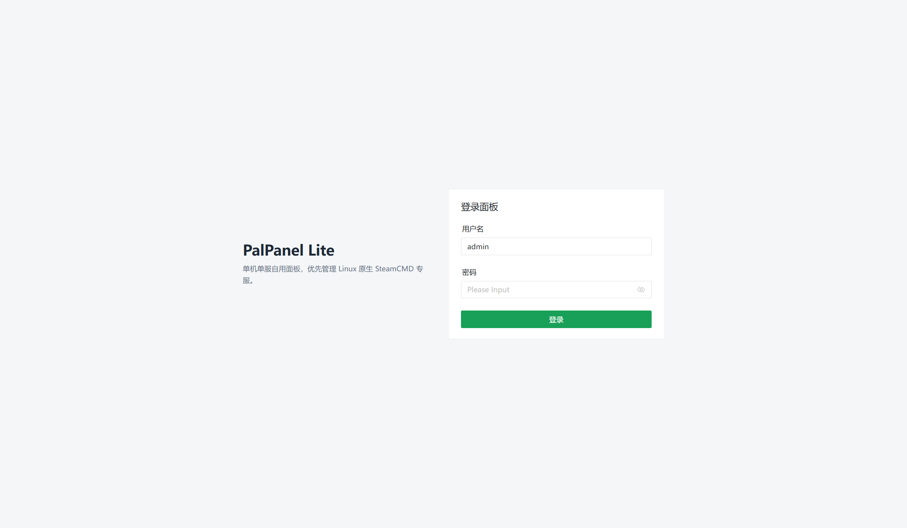
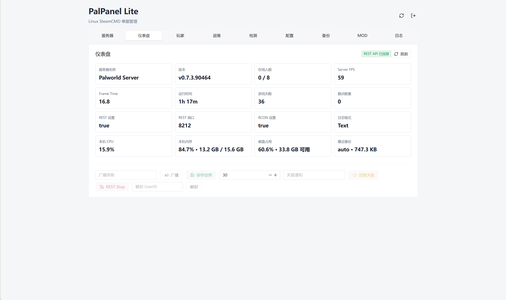
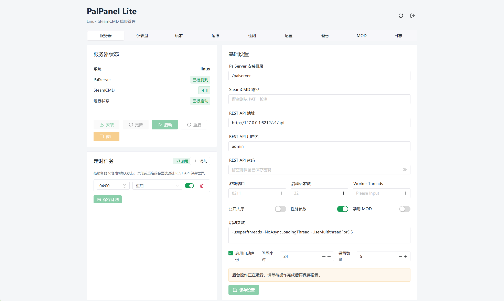
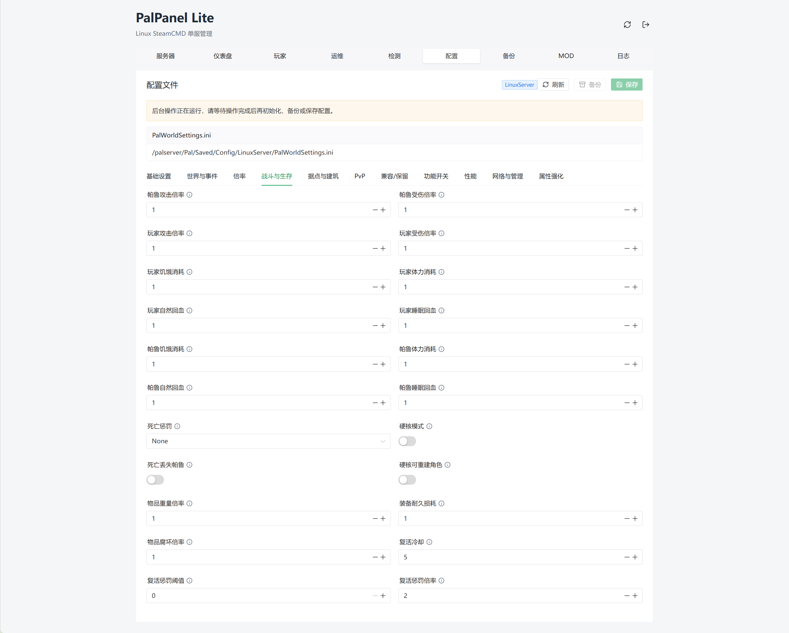
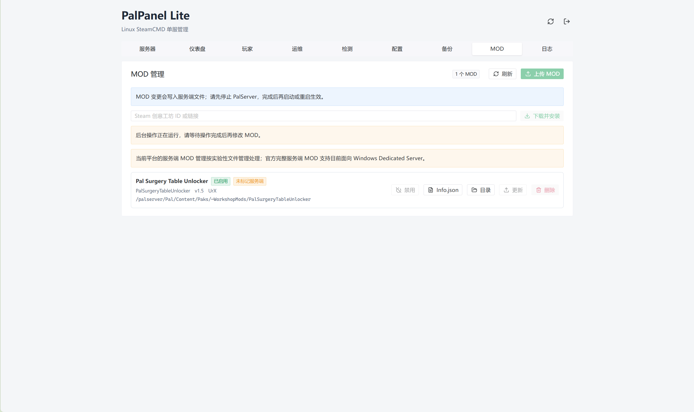

# PalPanel Lite

PalPanel Lite 是一个面向自用场景的 Palworld 单机单服管理面板。推荐使用 Docker Compose 一键部署，面板会在同一台 Linux 服务器上管理 Palworld Dedicated Server，包括安装/更新、启动停止、配置编辑、备份恢复、MOD 管理、玩家管理、日志查看和 Palworld REST API 操作。

默认部署镜像：

```text
ghcr.io/ksamni/palpanel-lite:latest
```

## 适用范围

- 适合一台 Linux 机器管理一台 Palworld 专服。
- 当前主要目标是 Linux + Docker Compose。
- 默认只把面板绑定到 `127.0.0.1`，远程访问建议放在反向代理、VPN 或 SSH 隧道后面。
- Palworld 游戏端口默认发布 UDP `8211`。
- Palworld REST API 和 RCON 默认不对外发布，应通过面板后端访问。
- Docker 运行镜像主要面向 Linux amd64 主机，因为 SteamCMD 和 Palworld Dedicated Server 是 x86_64 目标。

## 界面预览











## 一键部署

### 只用 docker-compose.yml 和 .env 部署

最简单的部署方式是准备一个部署目录，放入 `docker-compose.yml` 和 `.env` 两个文件，然后让 Docker Compose 直接从 GHCR 拉取镜像运行。这个流程不需要克隆源码，也不需要本地构建镜像。

在服务器上准备部署目录：

```bash
mkdir -p /srv/palpanel
cd /srv/palpanel
```

下载根目录的 `docker-compose.yml` 和 `.env.example`，并把 `.env.example` 保存为本地 `.env`：

```bash
curl -fsSLo docker-compose.yml https://raw.githubusercontent.com/KSAMNI/pal_tool/main/docker-compose.yml
curl -fsSLo .env https://raw.githubusercontent.com/KSAMNI/pal_tool/main/.env.example
```

创建持久化目录：

```bash
mkdir -p data PalServer
```

启动。没有指定 `-f` 时，Docker Compose 会自动使用当前目录下的 `docker-compose.yml`，并通过 `--env-file .env` 读取本地配置：

```bash
docker compose --env-file .env pull
docker compose --env-file .env up -d
```

这会从 `PALPANEL_IMAGE` 指定的 GHCR 镜像拉取并启动 `palpanel` 服务，不会构建本地镜像。

如果服务器不能访问 `raw.githubusercontent.com`，也可以手动创建下面两个文件。

`docker-compose.yml`：

```yaml
services:
  palpanel:
    image: ${PALPANEL_IMAGE:-ghcr.io/ksamni/palpanel-lite:latest}
    restart: unless-stopped
    init: true
    stop_grace_period: 60s
    environment:
      HOME: /data
      PALPANEL_ADDR: 0.0.0.0:8080
      PALPANEL_DATA_DIR: /data
      PALPANEL_UID: ${PALPANEL_UID:-10001}
      PALPANEL_GID: ${PALPANEL_GID:-10001}
      PALPANEL_FIX_OWNERSHIP: ${PALPANEL_FIX_OWNERSHIP:-true}
      PALPANEL_STEAMCMD_DIR: ${PALPANEL_STEAMCMD_DIR:-/data/steamcmd}
      PALPANEL_STEAMCMD_USERNAME: ${PALPANEL_STEAMCMD_USERNAME:-}
      PALPANEL_STEAMCMD_PASSWORD: ${PALPANEL_STEAMCMD_PASSWORD:-}
      PALPANEL_DEFAULT_PAL_SERVER_PATH: ${PALPANEL_DEFAULT_PAL_SERVER_PATH:-/palserver}
      PALPANEL_PAL_SERVER_PATH: /palserver
      PALWORLD_SERVER_PATH: /palserver
      PAL_SERVER_PATH: /palserver
      TZ: ${TZ:-Asia/Shanghai}
    ports:
      - "127.0.0.1:${PALPANEL_PORT:-8080}:8080"
      - "${PALWORLD_GAME_HOST_PORT:-8211}:${PALWORLD_GAME_PORT:-8211}/udp"
    volumes:
      - type: bind
        source: ${PALPANEL_DATA_DIR:-./data}
        target: /data
      - type: bind
        source: ${PALPANEL_SERVER_DIR:-./PalServer}
        target: /palserver
    healthcheck:
      test: ["CMD", "curl", "-fsS", "http://127.0.0.1:8080/api/health"]
      interval: 30s
      timeout: 5s
      retries: 3
      start_period: 10s
```

创建 `.env`：

```env
PALPANEL_IMAGE=ghcr.io/ksamni/palpanel-lite:latest
PALPANEL_PORT=8080

PALWORLD_GAME_HOST_PORT=8211
PALWORLD_GAME_PORT=8211

PALPANEL_DATA_DIR=./data
PALPANEL_SERVER_DIR=./PalServer

PALPANEL_STEAMCMD_DIR=/data/steamcmd
PALPANEL_STEAMCMD_USERNAME=
PALPANEL_STEAMCMD_PASSWORD=
PALPANEL_DEFAULT_PAL_SERVER_PATH=/palserver

PALPANEL_UID=10001
PALPANEL_GID=10001
PALPANEL_FIX_OWNERSHIP=true
TZ=Asia/Shanghai
```

这会启动 `palpanel` 服务，并挂载当前目录下的：

```text
./data
./PalServer
```

这个 `docker-compose.yml` 的默认行为：

- 拉取 `${PALPANEL_IMAGE}`，默认是 `ghcr.io/ksamni/palpanel-lite:latest`。
- 将面板发布到宿主机 `127.0.0.1:${PALPANEL_PORT:-8080}`。
- 将 Palworld 游戏 UDP 端口发布为 `${PALWORLD_GAME_HOST_PORT:-8211}:${PALWORLD_GAME_PORT:-8211}/udp`。
- 将 `./data` 挂载到容器 `/data`。
- 将 `./PalServer` 挂载到容器 `/palserver`。
- 给新数据库默认写入 `pal_server_path=/palserver`。
- 使用镜像内置的 SteamCMD，面板里的 `SteamCMD 路径` 可以留空。
- 容器启动时会修复 `/data`、`/palserver`、`/data/steamcmd` 权限，然后以 `PALPANEL_UID`/`PALPANEL_GID` 运行面板。

查看状态和日志：

```bash
docker compose ps
docker compose logs -f palpanel
```

在服务器本机访问：

```text
http://127.0.0.1:8080
```

远程服务器默认不会直接对公网监听面板端口。推荐使用 SSH 隧道：

```bash
ssh -L 8080:127.0.0.1:8080 user@your-server
```

然后在本地浏览器打开：

```text
http://127.0.0.1:8080
```

如果要让外部玩家加入服务器，请在服务器防火墙和云安全组放行 Palworld 游戏 UDP 端口，默认是：

```text
8211/udp
```

## 部署目录

根目录 `docker-compose.yml` 默认使用：

```text
./data       面板数据、SQLite 数据库、备份、SteamCMD 运行状态
./PalServer  Palworld Dedicated Server 安装目录
```

容器内部路径是：

```text
/data       面板数据目录
/palserver  Palworld 服务端目录
```

面板里的 `pal_server_path` 应填写容器内路径：

```text
/palserver
```

不要填写宿主机路径，例如 `/srv/palworld/PalServer`。

## .env 配置

常用配置：

```env
PALPANEL_IMAGE=ghcr.io/ksamni/palpanel-lite:latest
PALPANEL_PORT=8080

PALWORLD_GAME_HOST_PORT=8211
PALWORLD_GAME_PORT=8211

PALPANEL_DATA_DIR=./data
PALPANEL_SERVER_DIR=./PalServer

PALPANEL_STEAMCMD_DIR=/data/steamcmd
PALPANEL_DEFAULT_PAL_SERVER_PATH=/palserver

PALPANEL_UID=10001
PALPANEL_GID=10001
PALPANEL_FIX_OWNERSHIP=true

TZ=Asia/Shanghai
```

字段含义：

| 变量 | 含义 |
|---|---|
| `PALPANEL_IMAGE` | Compose 拉取的面板镜像 |
| `PALPANEL_PORT` | 面板宿主机端口，默认绑定到 `127.0.0.1` |
| `PALWORLD_GAME_HOST_PORT` | 宿主机对外开放的 Palworld UDP 游戏端口 |
| `PALWORLD_GAME_PORT` | 容器内 Palworld 游戏端口，应和面板启动参数保持一致 |
| `PALPANEL_DATA_DIR` | 宿主机面板数据目录 |
| `PALPANEL_SERVER_DIR` | 宿主机 PalServer 目录 |
| `PALPANEL_STEAMCMD_DIR` | 容器内 SteamCMD 可写状态目录 |
| `PALPANEL_DEFAULT_PAL_SERVER_PATH` | 新数据库首次写入的 PalServer 路径，容器部署应为 `/palserver` |
| `PALPANEL_UID` / `PALPANEL_GID` | 面板进程运行用户 |
| `PALPANEL_FIX_OWNERSHIP` | 启动时修复挂载目录权限 |
| `TZ` | 容器时区，定时任务的每日执行时间按此时区解释，默认 `Asia/Shanghai`（北京时间） |

Steam Workshop 匿名下载失败时，可以配置 Steam 账号：

```env
PALPANEL_STEAMCMD_USERNAME=你的Steam账号
PALPANEL_STEAMCMD_PASSWORD=你的Steam密码
```

这个账号需要拥有 Palworld。密码会在面板任务日志里被打码，但它仍然是容器环境变量，宿主机管理员可以看到。

生产环境建议把数据目录换成绝对路径：

```env
PALPANEL_DATA_DIR=/srv/palpanel/data
PALPANEL_SERVER_DIR=/srv/palpanel/PalServer
```

修改 `.env` 后重新应用：

```bash
docker compose --env-file .env up -d
```

## 首次使用

第一次打开面板时，会要求创建管理员账号。账号只保存在面板自己的 SQLite 数据库中。

创建账号后建议按这个顺序操作：

1. 打开 `服务器` 页面。
2. 确认 `PalServer 路径` 是 `/palserver`。
3. `SteamCMD 路径` 可以留空，镜像已经包含 `/usr/local/bin/steamcmd`，面板会从 `PATH` 检测。
4. 保存设置。
5. 点击 `安装`，面板会用 SteamCMD 下载 Palworld Dedicated Server。
6. 安装完成后点击 `启动`。
7. 第一次启动会创建 `Pal/Saved/Config/LinuxServer/PalWorldSettings.ini` 等运行配置目录。
8. 如需修改配置，先停止服务器，再进入 `配置` 页面初始化和保存配置。

安装成功后宿主机目录通常会出现：

```text
./PalServer/PalServer.sh
./PalServer/Pal/
./PalServer/Engine/
./PalServer/steamapps/
```

## 常用 Compose 命令

启动或应用配置：

```bash
docker compose --env-file .env up -d
```

停止并移除容器：

```bash
docker compose down
```

查看日志：

```bash
docker compose logs -f palpanel
```

拉取新镜像并重启：

```bash
docker compose --env-file .env pull
docker compose --env-file .env up -d
```

进入容器检查目录：

```bash
docker compose exec palpanel sh
ls -la /data
ls -la /palserver
```

查看镜像版本：

```bash
docker compose images
```

## 更新

### 更新面板

```bash
docker compose --env-file .env pull
docker compose --env-file .env up -d
```

如果浏览器仍显示旧 UI，先确认镜像已经更新，再强制刷新浏览器缓存。

### 更新 PalServer

在面板 `服务器` 页面点击 `更新`。如果服务器由面板启动且正在运行，面板会先停止服务器，更新成功后再尝试启动。更新前会创建预操作备份。

如果 PalServer 是在面板外部启动的，面板会阻止更新。先在外部停止服务器，再通过面板更新。

## 配置 PalWorldSettings.ini

运行配置文件位置：

```text
/palserver/Pal/Saved/Config/LinuxServer/PalWorldSettings.ini
```

宿主机对应：

```text
./PalServer/Pal/Saved/Config/LinuxServer/PalWorldSettings.ini
```

不要直接修改：

```text
DefaultPalWorldSettings.ini
```

推荐流程：

1. 停止 PalServer。
2. 打开 `配置` 页面。
3. 如果提示未初始化，点击 `初始化`。
4. 修改配置项。
5. 点击 `保存`。
6. 启动或重启 PalServer 生效。

常见配置：

| 前端字段 | 原始配置 key | 说明 |
|---|---|---|
| 自动保存间隔 | `AutoSaveSpan` | 单位秒，`30.000000` 表示 30 秒 |
| 服务器名称 | `ServerName` | 服务器列表显示名称 |
| 服务器玩家上限 | `ServerPlayerMaxNum` | 最大可加入玩家数 |
| REST API | `RESTAPIEnabled` | 是否开启 Palworld REST API |
| REST API 端口 | `RESTAPIPort` | 默认 `8212` |
| 管理员密码 | `AdminPassword` | REST API 和游戏内管理员相关密码 |
| 官方存档备份 | `bIsUseBackupSaveData` | Palworld 官方存档备份 |
| 允许客户端 MOD | `bAllowClientMod` | 是否允许启用 MOD 的客户端加入 |
| PvP 模式 | `bIsPvP` | PvP 总开关 |

## Palworld REST API

面板会通过后端代理 Palworld REST API，浏览器不会直接拿到 REST Basic Auth。

推荐启用方式：

1. 停止服务器。
2. 打开 `配置` 页面。
3. 设置 `RESTAPIEnabled=True`、`RESTAPIPort=8212`、`AdminPassword=一个强密码`。
4. 保存配置。
5. 打开 `服务器` 页面。
6. REST API URL 填写 `http://127.0.0.1:8212/v1/api`。
7. REST 用户名通常是 `admin`。
8. REST 密码填写 `AdminPassword`。
9. 启动或重启服务器。
10. 打开 `仪表盘` 或 `玩家` 页面检查是否连接成功。

不要把 `8212` 直接暴露到公网。默认 Compose 文件也不会发布这个端口。

## 备份和恢复

面板备份存放在：

```text
./data/backups
```

推荐规则：

- 更新服务器前先备份。
- 修改配置前先备份。
- 安装、更新、删除 MOD 前先备份。
- 恢复备份前确认 PalServer 已停止。

手动备份：

1. 打开 `备份` 页面。
2. 点击 `手动备份`。

恢复备份：

1. 停止 PalServer。
2. 打开 `备份` 页面。
3. 找到目标备份。
4. 点击 `恢复`。
5. 确认操作。

面板在恢复前会尽量创建恢复前保护备份。

## MOD 管理

MOD 修改必须在 PalServer 停止时进行。上传、下载、启用、禁用、更新、删除后，都需要启动或重启服务器才能生效。

### Steam Workshop 自动下载

在 `MOD` 页面输入 Steam Workshop ID 或链接，然后点击下载安装。

示例：

```text
3625364851
https://steamcommunity.com/sharedfiles/filedetails/?id=3625364851
```

如果日志出现匿名 SteamCMD 下载失败，先在 `.env` 里配置 Steam 账号，再重启面板容器：

```bash
docker compose --env-file .env up -d
```

### 手动上传 MOD 压缩包

面板支持：

```text
.zip
.7z
.rar
```

压缩包里必须能找到 `Info.json`。

普通官方服务端 MOD 结构：

```text
Mods/Workshop/任意目录名/Info.json
```

Steam 客户端常见 ManagedMods/Paks 结构：

```text
Pal/Content/Paks/~WorkshopMods/PackageName/xxx.pak
Mods/ManagedMods/PackageName/Info.json
Mods/ManagedMods/PackageName/InstallManifest.json
```

上传流程：

1. 停止 PalServer。
2. 打开 `MOD` 页面。
3. 点击 `上传 MOD`。
4. 选择压缩包。
5. 上传成功后点击 `启用`。
6. 启动或重启 PalServer。

## 远程访问建议

默认 Compose 只监听：

```text
127.0.0.1:8080
```

推荐方式：

- 使用 SSH 隧道。
- 使用 VPN。
- 使用带 HTTPS 的反向代理。

反向代理终止 HTTPS 时，应设置：

```text
X-Forwarded-Proto: https
```

不要直接把 Palworld REST API 端口 `8212` 或 RCON 端口暴露到公网。

## 常见问题

### 拉取 GHCR 镜像失败

如果镜像包不是公开的，先登录 GHCR：

```bash
docker login ghcr.io
docker compose --env-file .env pull
```

登录账号需要有读取 `ghcr.io/ksamni/palpanel-lite` 的权限。

### `unable to open database file: out of memory (14)`

这通常不是内存不足，而是 SQLite 打不开 `/data/app.db`，常见原因是挂载目录权限不对。

检查：

```bash
ls -la ./data
docker compose logs -f palpanel
```

默认镜像会先修复 `/data`、`/palserver`、`/data/steamcmd` 权限，再降权运行。保持：

```env
PALPANEL_FIX_OWNERSHIP=true
```

然后重启：

```bash
docker compose --env-file .env up -d
```

### 面板提示 PalServer 未安装

确认面板里的 `PalServer 路径` 是：

```text
/palserver
```

然后点击 `安装`。

宿主机上应能看到：

```text
./PalServer/PalServer.sh
```

### 配置页提示未初始化

Palworld 的运行配置通常要在服务器至少启动过一次后才完整生成。可以：

1. 安装 PalServer。
2. 启动一次。
3. 停止。
4. 回到 `配置` 页面点击 `初始化`。

### REST API 未连接

检查：

- `RESTAPIEnabled=True`
- `RESTAPIPort=8212`
- `AdminPassword` 已设置
- 面板 REST API URL 是 `http://127.0.0.1:8212/v1/api`
- REST 用户名是 `admin`
- REST 密码是 `AdminPassword`
- 修改配置后已经重启 PalServer

### 不能保存配置或修改 MOD

面板会阻止危险状态下的文件修改。常见原因：

- PalServer 正在运行。
- PalServer 是在面板外部启动的。
- 后台还有安装、更新、备份、恢复、MOD 操作正在执行。

先停止服务器并等待后台任务完成。

### 端口冲突

如果游戏端口、REST API 端口或 RCON 端口显示被占用：

- 服务器正在运行时，游戏端口被占用可能是正常的。
- 启动前端口已占用，说明有冲突，需要换端口或停止占用进程。
- Docker 部署时游戏端口要同时对齐 `.env` 和面板启动参数。

## 本地构建镜像

普通部署不需要本地构建。需要从源码构建时使用：

```bash
cp .env.example .env
docker compose --env-file .env -f deploy/compose.yaml build
docker compose --env-file .env -f deploy/compose.yaml up -d
```

`deploy/compose.yaml` 会从仓库源码构建镜像，主要用于开发、测试或自定义版本。

## 开发

后端开发：

```powershell
go run ./cmd/palpanel -addr 127.0.0.1:8080 -data-dir data
```

前端开发：

```powershell
cd web
npm install
npm run dev
```

生产前端构建：

```powershell
cd web
npm run build
```

测试和构建检查：

```powershell
go test ./...
cd web
npm run build
```

## 安全提醒

- 面板账号密码只保护面板，不要把面板裸露到公网。
- 不要直接暴露 Palworld REST API 和 RCON。
- 备份、恢复、更新、MOD 都可能影响存档，操作前先备份。
- MOD 可能导致崩溃或坏档，只安装可信来源的服务端 MOD。
- `.env` 可能包含 Steam 密码，不要提交到 Git。
